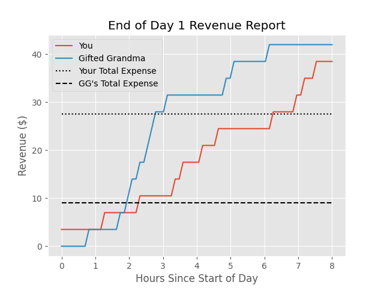

# CoffeeShop
## By Kerwin Chen, Timothy Liu, Mary Eng

### Introduction
In this coffeeshop simulation game, you will run a coffee shop and try to make as much profit as you can everyday, competing against a bot with 3 difficulties (from the easiest bot Silly Sam to the hardest bot Gifted Grandma). 

During each day, you can:
* Create a new coffee recipe
* Set your price for a cup of coffee
* (Re)stock your inventory

At the end of each day, a revenue report is generated.

### Sample Revenue Report
Example revenue report generated at the end of the day:

### Helpful Hints and Tricks
* Customers generally prefer 0 to 4 units each of sugar, milk, and beans in their coffee 
* Customers generally will pay $2 to $5 for their cup of coffee
* Customers generally prefer hot coffee on colder days and cold coffee on hotter days 
* If it's too cold or too hot that day, less customers will come by your coffee shop (but those who do come may be willing to pay more!)
* Customer preference parameters are generated from different probability distributions; the above doesn't apply to all customers and customers will change from day to day!

### Installation and Gameplay
To install, clone repository and follow instructions found in `INSTALL.txt`.
To play, use the command `make build` followed by `make play`.

